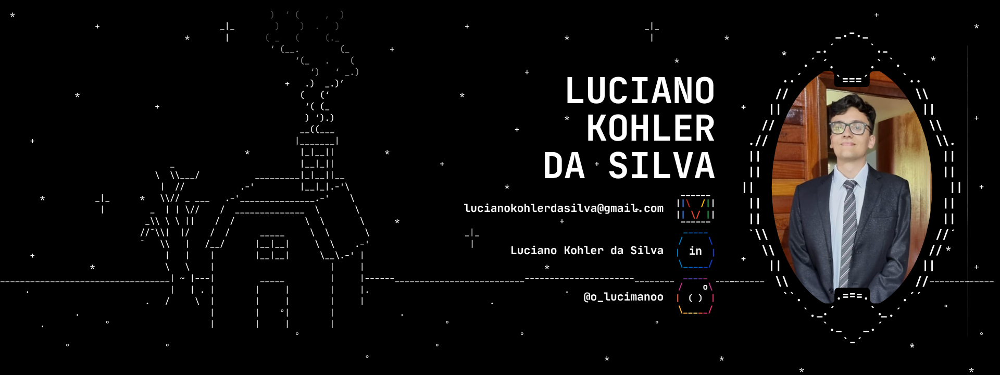

<i>O impossível é só questão de opinião - Charlie Brown Jr.</i>

# 👤 Sobre Mim
  Sudações! Me chamo **Luciano** e estou atualmente desfrutando do curso de **Bacharelado em Ciência da Computação** na [**Universidade do Estado de Santa Catarina** (UDESC)](https://www.udesc.br/) em Joinville - SC.

  Anteriormente em 2023, também me formei como **Técnico em Análise e Desenvolvimento de Sistemas** junto com o [**SESI/SENAI**](https://cursos.sesisenai.org.br/) (Juntos agora como Escola S de Referência).

  Agora, com minha fome de conhecimento, estou cada vez mais interessado no mundo infinito da programação, e espero que um dia, eu possa ajudar o mundo com minhas futuras linhas de código!

# 🧩 Tecnologias conhecidas

# 💭 Interesses Futuros

# 🛠️ Projetos em Destaque
- [A Night In The Island](https://github.com/LucianoKohler/a-night-in-the-island): Videogame de mistério e aventura com 100% dos seus gráficos feitos com artes de ASCII, onde tudo é feito com caracteres do teclado  
- [Comércio Liberado](https://github.com/LucianoKohler/comercio-liberado): Clone do Mercado Livre feito em **React**, utilizando a API do site original para pesquisar os produtos e mostrá-los na tela de forma responsiva
- [Rede Social de Fotos](https://github.com/LucianoKohler/BachareladoEmCienciaDaComputacao/tree/master/POO%20-%20Programa%C3%A7%C3%A3o%20Orientada%20a%20Objetos/TrabalhoRedeSocialFotos): Aplicativo feito em **Java** integrado com um banco de dados em **PostreSQL**, com funcionalidades como seguir usuários, favoritar e criar posts, além de poder alterar suas informações de perfil, tudo com interfaces gráficas intuitivas

# 🎶 Fun Fact
No meu tempo livre, gosto de praticar no meu violão e um dia, arrancar uns sorrisos dos meus amigos!

# 📞 Contato
**Vamos trocar uma ideia!**
- E-mail: lucianokohlerdasilva@gmail.com
- LinkedIn: [Luciano Kohler da Silva](https://www.linkedin.com/in/luciano-kohler-da-silva)
- Instagram: [@o_lucimanoo](https://www.instagram.com/o_lucimanoo/)